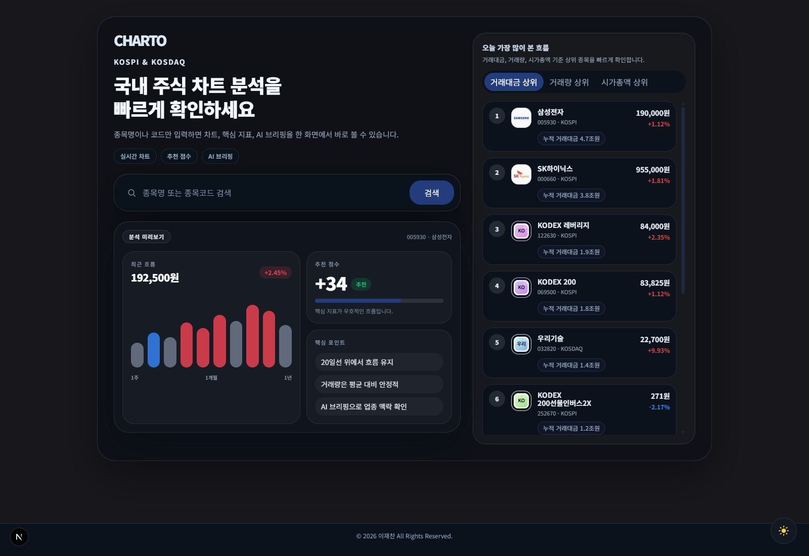

# CHARTO




국내 주식 차트와 기술지표를 빠르게 확인하는 웹앱입니다.  
종목명이나 종목코드를 검색하면 차트, 핵심 지표, 추천 점수, AI 브리핑을 한 화면에서 볼 수 있습니다.

## 주요 기능

- 국내 주식 검색
- 분봉, 일봉, 주봉 차트 조회
- 5일선, 20일선, RSI, MACD, 볼린저 밴드 분석
- 추천 점수와 핵심 근거 표시
- 로그인 사용자 대상 AI 브리핑 제공
- Open DART 기반 업종/기업 맥락 보강
- 거래대금, 거래량, 시가총액 상위 종목 확인(제공처 : <a href="https://apiportal.koreainvestment.com/intro">KIS Developer</a>)
- 서비스 소개, 개인정보처리방침, 면책 고지, 문의 페이지 제공

## 실행 방법

```bash
pnpm install
cp .env.example .env
pnpm context:sync
pnpm dev
```

## Environment

- `KIS_APP_KEY`
- `KIS_APP_SECRET`
- `KIS_ENV`
- `GEMINI_API_KEY` 또는 `GEMINI_API_KEYS`
- `GEMINI_MODEL`
- `OPENDART_API_KEY`
- `AUTH_SECRET`
- `AUTH_GOOGLE_ID`
- `AUTH_GOOGLE_SECRET`
- `AUTH_KAKAO_ID`
- `AUTH_KAKAO_SECRET`
- `ADSENSE_PUBLISHER_ID`

키가 없으면 일부 기능은 데모 모드로 동작합니다.
`pnpm context:sync`를 실행하면 Open DART 업종 메타데이터를 미리 생성해 더 안정적으로 분류합니다.

## Validate

```bash
pnpm lint
pnpm build
```

## 라이선스

MIT License

## 출처 및 저작권

- 시세/순위 데이터: [한국투자 Open API](https://apiportal.koreainvestment.com/)
- 기업 공시 참고: [Open DART](https://opendart.fss.or.kr/)
- AI 요약: [Google Gemini API](https://ai.google.dev/)
- 아이콘: [Tabler Icons](https://tabler.io/icons) (MIT)
- 기업 로고와 상표의 권리는 각 소유자에게 있습니다.
- Copyright © 2026 DevJaepaL All Rights Reserved.
